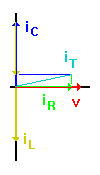

## Theory 

The schematic diagram below shows three components connected in parallel and to an AC voltage source: an ideal inductor, an ideal capacitor, and an ideal resistor. In keeping with our previous examples using inductors and capacitors together in a circuit, we will use the following values for our components:

$V_{ac} = 100\ VRMS$

$f = 10\ Hz$

$L = 2\ H$

$C = 0.0003\ F$

$R = 10\ \Omega$

 According to Ohm's Law:    

 $$i_L = \frac{V_L}{X_L} = 0.8\ A \quad ; \quad i_C = \frac{V_C}{X_C} = 1.89\ A \quad ; \quad i_R = \frac{V_R}{R} = 10\ A$$

If we measure the current from the voltage source, we find that it supplies a total of 10.06 A to the combined load.

So we now have 10 A of resistive current and just over 1.09 A of reactive current and yet the measured total current is 10.06 A. By now, you probably expected this, and you're familiar with the reasons for this apparent discrepancy. Nevertheless, it is worthwhile to complete the exercise and study this circuit in detail.

### The Vectors:

As usual, the vectors, shown to the right, tell the story. Since this is a parallel circuit, the voltage, <strong>V</strong>, is the same across all components. It is the current that has different phases and amplitudes within the different components.

  

 

Since voltage is the same throughout the circuit, we use it as the reference at 0°. Current through the resistor is in phase with the voltage dropped across that resistor, so <em>iR</em> also appears at 0°.

Current through an inductor lags the applied voltage, so <em>iL</em> appears at -90°. Current through a capacitor leads the applied voltage, so <em>iC</em> appears at +90°. Since <em>iC</em> is greater than <em>iL</em>, the net reactive current is capacitive, so its phase angle is +90°.

Now the total current, <em>iT</em>, is the vector sum of reactive current and resistive current. Since <em>iR</em> is significantly greater than the difference, <em>iC</em> − <em>iL</em>, the total impedance of this circuit is mostly resistive, and the combined vector for <em>iT</em> is at only a small phase angle, as shown in the diagram.

### The Mathematics:

Now we have a pretty clear idea of how the currents through the different components in this circuit relate to each other, and to the total current supplied by the source. Of course, we could draw these vectors precisely to scale and then measure the results to determine the magnitude and phase angle of the source current. However, such measurements are limited in precision. We can do far better by calculating everything and then using experimental measurements to verify that our calculations fit the real-world circuit.

We start with a few basic expressions:

$$i_T = \left( i_X^2 + i_R^2 \right)^{1/2}$$

$$\emptyset = \arctan \left( \frac{i_X}{i_R} \right)$$

Where,

$$i_X = i_C - i_L$$

$$\emptyset = \text{Phase angle}$$

Now simply insert the values we determined earlier and solve these expressions:

$$i_T = \left( i_X^2 + i_R^2 \right)^{1/2}$$

$$= 10.06\ A$$

$$\emptyset = \arctan \left( \frac{i_X}{i_R} \right)$$

$$= 6.214^\circ$$

These figures match the initial measured value for current from the source and fit the rough vector diagram as well. Therefore, we can be confident that our calculations and diagram are accurate.When $X_L=X_C$

When a circuit of this type operates at resonance, so that <em>XL</em> = <em>XC</em>, it must also follow that <em>iL</em> = <em>iC</em>. Therefore, <em>iC</em> − <em>iL</em> = 0, and the only current supplied by the source is <em>iR</em>.

This is in fact the case. At resonance, current circulates through <strong>L</strong> and <strong>C</strong> without leaving these two components, and the source only needs to supply enough current to make up for losses. In this case, <strong>R</strong> represents the energy losses within the circuit and <strong>R</strong> is the only component that draws current from the source. The effective impedance of the circuit is nothing more than <strong>R</strong>, and the current drawn from the source is in phase with the voltage.

This can be verified using the simulator by creating the above mentioned parallel LCR circuit and by measuring the current and voltage across the inductor, capacitor, and resistor. The values should be consistent with the earlier findings.

<strong>Applications:</strong>

<ul>
  <li>Voltage multiplier</li>
  <li>Pulse discharge circuit</li>
  <li>Signal processing</li>
  <li>Filters</li>
  <li>Oliver Heaviside</li>
</ul>

At resonance, the effective impedance of the circuit is nothing more than <strong>R</strong>, and the current drawn from the source is in phase with the voltage. The resonance frequency in our example is <strong>6.5 Hz</strong>.

